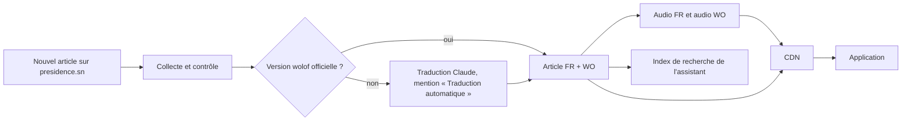
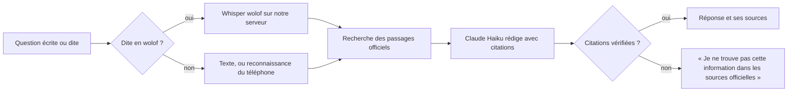

# Workflow de l'IA : proposition définitive

Proposé le 03/10/2026, à valider par le porteur du projet. Il réunit la traduction, les voix, la reconnaissance de la parole et l'assistant en une seule organisation, la plus simple et la moins coûteuse qui tienne 20 millions d'utilisateurs. Le détail des essais est dans `opportunites-participer-ia.md`.

## Le principe : faire une fois ce qui peut l'être

Deux familles de travaux, traitées différemment.

| Famille | Quand | Exemples | Coût |
|---|---|---|---|
| **Une fois par contenu** | À la publication d'un article ou d'une fiche, puis servi à tous depuis le CDN | Traduction en wolof, lecture audio en français et en wolof, index de recherche | Dépend du nombre d'articles (≈ 35 par mois), **pas du nombre d'utilisateurs** |
| **À chaque demande** | Quand une personne pose une question | Réponse de l'assistant, reconnaissance d'une question dite à voix haute | Dépend du nombre de questions : plafonné |

C'est ce qui rend le projet tenable : un article lu par un million de personnes n'est traduit et mis en voix qu'une seule fois.

## Les briques retenues

| Besoin | Solution | Où | Pourquoi |
|---|---|---|---|
| Traduire en wolof les articles sans version officielle | **Claude** (API d'Anthropic), par lots, avec un lexique tiré des 318 articles officiels et des exemples | Fournisseur | Essai du 03/10 jugé « parfait » ; moins de 20 $ pour tout l'historique |
| Lire les articles en wolof | **Adia_TTS** (Apache 2.0) | Notre serveur | Voix adoptée le 02/10 ; aucun coût à l'usage |
| Lire les articles en français | La voix retenue à l'essai d'écoute du 03/10 (Adia, Kokoro ou Piper, toutes libres) | Notre serveur | Remplace la voix robotique du téléphone ; aucun coût à l'usage |
| Retrouver les passages officiels pour l'assistant | **Recherche par le sens** (e5-base, MIT) et par mots, déjà construite | Notre serveur | Bonne page dans les 3 premières pour 94 % des 72 questions d'essai ; les questions ne sortent pas |
| Rédiger la réponse de l'assistant | **Claude Haiku 4.5**, avec le contrat déjà construit : uniquement nos sources, citations vérifiées avant affichage, « je ne sais pas » sinon | Fournisseur | Le moins cher des modèles Claude ; le garde-fou bloque toute invention |
| Comprendre une question dite en français | La **reconnaissance vocale du téléphone** | Sur le téléphone | Gratuite, rapide, la voix ne quitte pas le téléphone |
| Comprendre une question dite en wolof | **Whisper adapté au wolof** (MIT) | Notre serveur | Aucun téléphone ne reconnaît le wolof |
| Texte écrit de l'audio | Le texte de l'article lui-même | Rien à faire | L'audio est fabriqué à partir du texte |

**Un seul fournisseur extérieur** : Anthropic, pour la traduction et l'assistant, avec une seule clé et une seule facture. Tout le reste tourne sur notre serveur d'IA, isolé de l'API publique : si l'IA tombe, l'application reste entièrement utilisable (CLAUDE.md, résilience).

## Le parcours d'un article

## Le parcours d'une question

## Coûts estimés

Tarifs publics de Claude au 03/10/2026 ([claude.com/pricing](https://claude.com/pricing)) : Haiku 4.5 à 1 $ / 5 $ par million de jetons (entrée / sortie), Sonnet 5.5 à 2 $ / 10 $, Opus 5.5 à 4 $ / 20 $, moitié prix en traitement différé.

| Poste | Estimation | Commentaire |
|---|---|---|
| Traduction de l'historique (≈ 655 articles) | Moins de 20 $, une fois | Traitement différé |
| Traduction des nouveaux articles | Moins de 1 $ par mois | ≈ 35 articles |
| Audio français et wolof | Temps de calcul de notre serveur | Sur l'ordinateur de développement : ≈ 13 fois la durée de la parole pour le wolof ; à mesurer sur le serveur choisi. Pour l'historique, louer quelques heures de carte graphique est une option (à chiffrer) |
| Assistant | ≈ 0,005 $ par question avec Haiku 4.5 | Soit ≈ 500 $ pour 100 000 questions par mois. Les questions fréquentes reçoivent une réponse mise en cache, sans nouveau coût. Plafond mensuel qui coupe l'assistant une fois atteint, limite par installation |
| Serveur d'IA | Selon l'hébergement (point 27) | Un serveur sans carte graphique suffit pour commencer |

## Mise en place, dans l'ordre

1. **Traduction et audio des articles** : utiles à tout le monde, coût minime. Banc d'essai sur 30 articles officiels pour choisir entre Sonnet 5.5 et Opus 5.5 (moins de 2 $), puis traitement de l'historique et des nouveaux articles.
2. **Assistant écrit en français**, ouvert d'abord à un groupe pilote par interrupteur à distance, avec mesure de la justesse sur nos jeux d'essai.
3. **Questions dites à voix haute et assistant en wolof**.

## À valider

1. Anthropic comme seul fournisseur extérieur (traduction et assistant).
2. Voix, recherche et reconnaissance du wolof sur notre propre serveur.
3. Le banc d'essai de traduction (moins de 2 $), puis la traduction de l'historique (moins de 20 $).
4. Le plafond mensuel de l'assistant au pilote.
5. L'hébergement (point 27), dont dépend le serveur d'IA.
